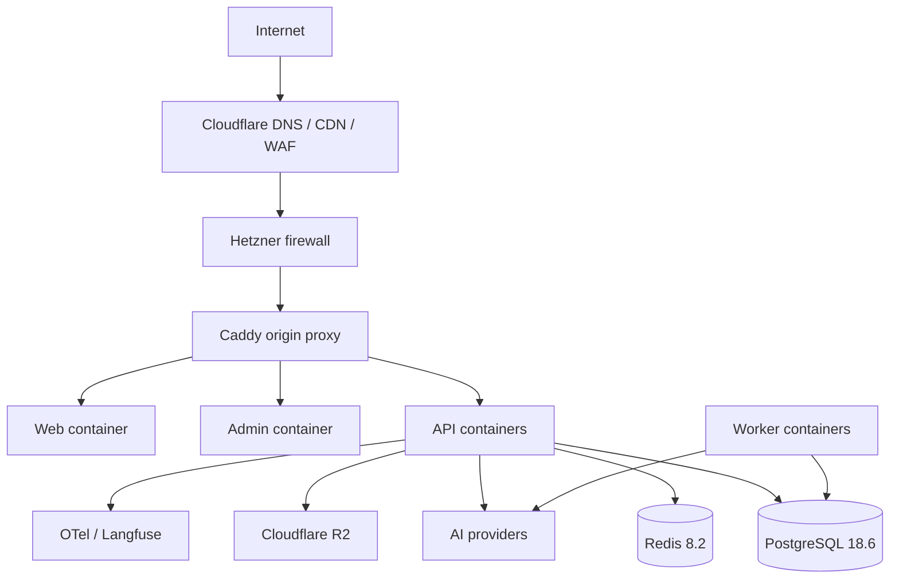
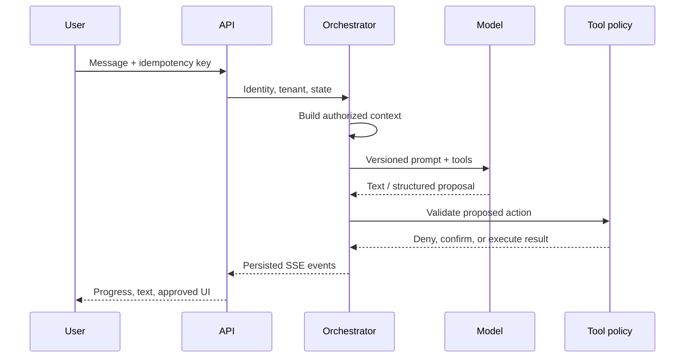
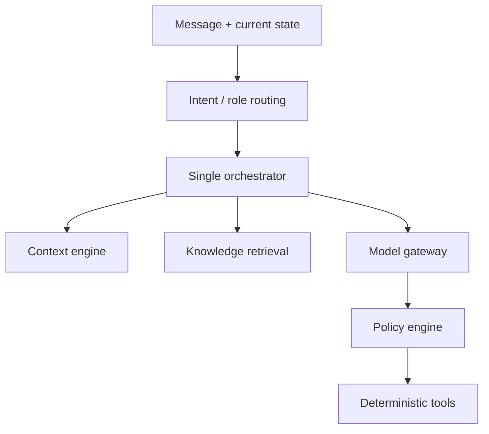
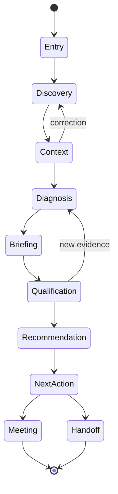
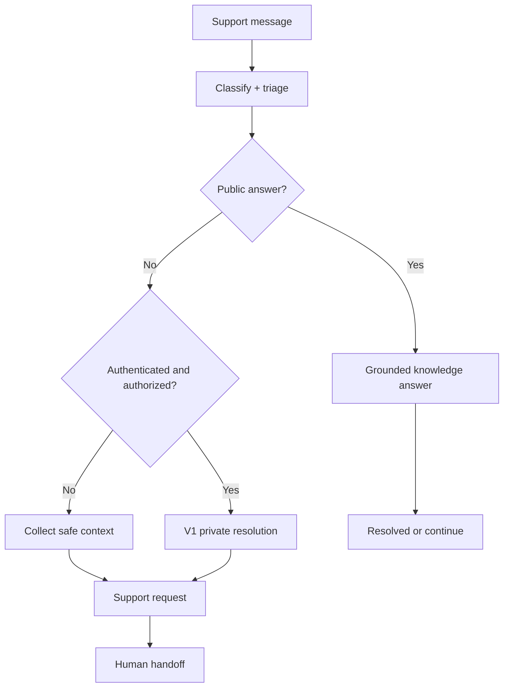
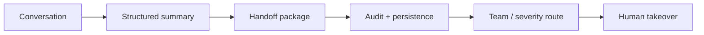
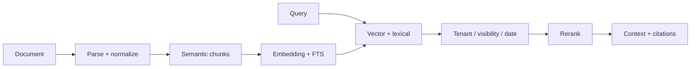
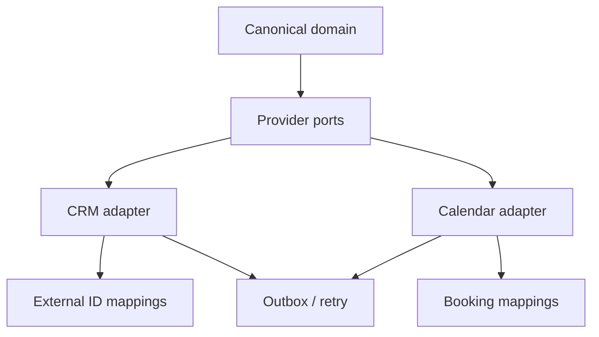
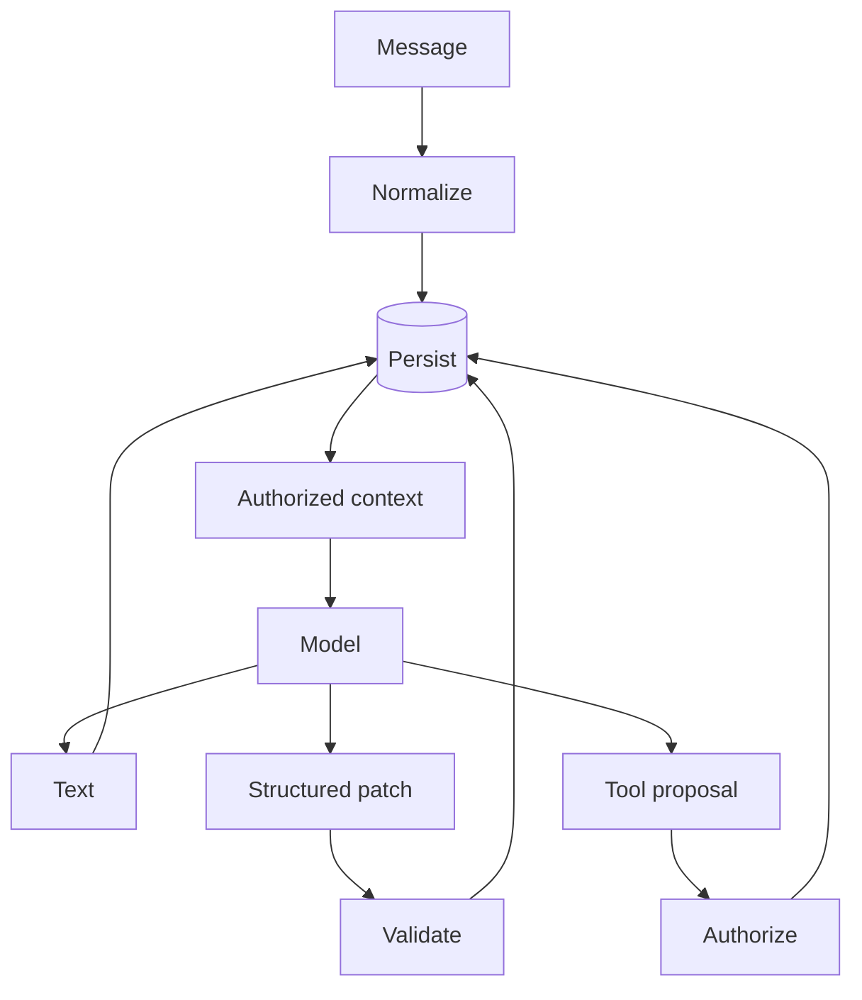
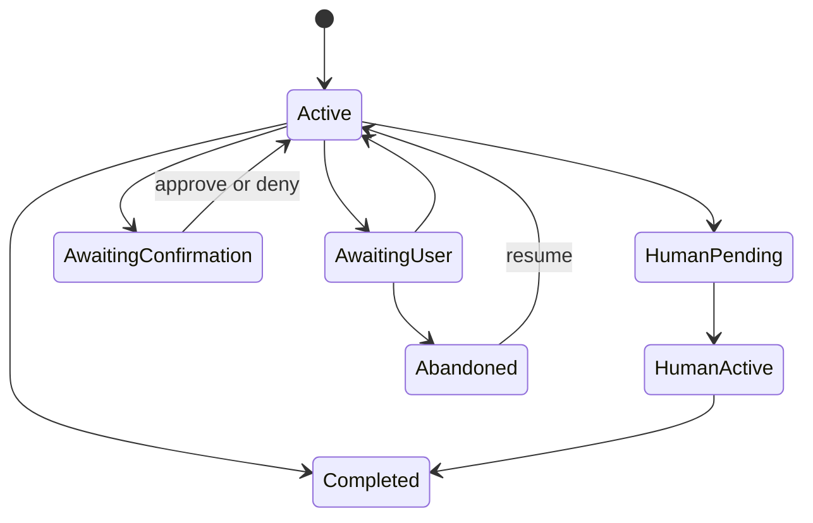

# Architecture Diagrams

## Deployment

## AI request lifecycle

## Agent orchestration

## New business journey

## Support journey

## Human handoff

## Knowledge / RAG

## CRM and calendar adapters

## Data flow

## Conversation state

The business journey stage is separate from the conversation lifecycle state; changing intent does not corrupt message/run lifecycle.
