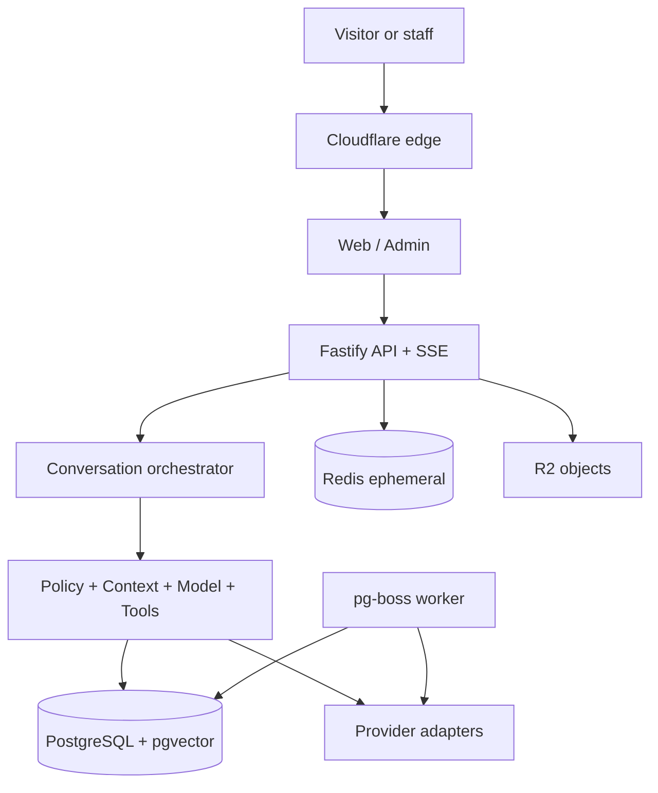

# System Architecture

The canonical decisions are in `/ARCHITECTURE.md`; this file expands component responsibilities and scaling boundaries.

## Component contracts

- Edge never authenticates application resources; it reduces abuse and forwards trusted proxy headers from an allowlist.
- Web owns presentation/session UX, never business authority.
- API owns identity resolution, commands, queries, orchestration, authorization and SSE.
- Orchestrator is a state-aware application service, not a free-running agent loop.
- Policy engine computes capabilities from tenant, actor, resource, state and feature flags.
- Context engine returns ordered typed blocks with provenance, sensitivity and token budget.
- Model gateway never receives provider credentials from callers and never executes tools directly.
- Tool executor is the only route to side effects.
- Worker consumes versioned jobs and outbox events with idempotent handlers.
- Providers translate canonical records; external IDs never become domain primary keys.

## Scaling boundaries

Scale web/API horizontally once CPU or active SSE connections exceed one node headroom. Use sticky-free signed session/state because the database owns conversation state. Scale workers by queue and concurrency with pg-boss singleton/lease semantics. Scale PostgreSQL vertically first; add read replicas only for analytics/admin queries proven by metrics. Move vector search only when millions of active chunks and latency/recall tests show PostgreSQL is the bottleneck. Redis loss may reduce limiting precision but not corrupt business state.

## Failure domains

| Failure | Required behavior |
|---|---|
| Model primary | Retry only safe transport errors, then compatible provider/model fallback; disclose degraded state |
| PostgreSQL | Readiness false, no writes or invented success; edge returns maintenance response |
| Redis | Local conservative limiter fallback; readiness remains true with degraded metric |
| RAG | Answer only from safe general capability or state knowledge unavailable; never fabricate |
| CRM | Persist canonical lead and `PENDING_SYNC`; retry job; meeting/user experience can continue |
| Calendar | Capture scheduling intent; do not claim slot/booking |
| Handoff notification | Persist handoff; retry notification; show reference to user |
| SSE disconnect | Resume using persisted message/run and event cursor; avoid duplicate generation |
