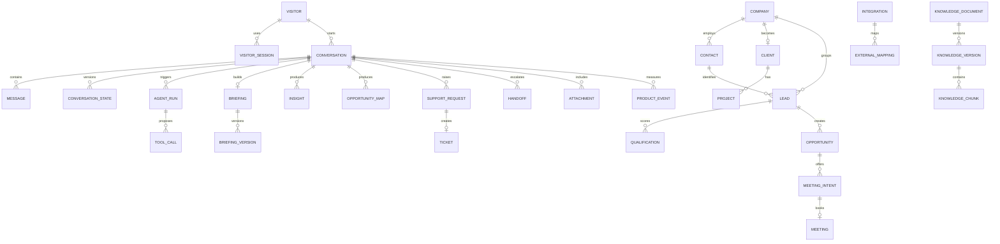

# Entity Relationship Diagram

The simplified ERD omits auth library tables, outbox receipts, consent links and several versioning relations for readability. `schema.sql` is authoritative for table-level design.
